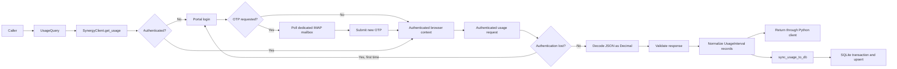

# WA Synergy Energy usage retrieval implementation plan

## Repository findings

- The repository currently contains only `.gitignore`; there is no implementation or project configuration to preserve.
- The public [Synergy My Account](https://my.synergy.net.au/) login currently redirects to `/s/login/` and loads Salesforce Experience Cloud/Aura resources.
- The exact login actions, OTP message format, authenticated usage endpoint, response schema, pagination, and date limits require an authorized, sanitized network capture. They should not be guessed or hard-coded from public bootstrap URLs.

No implementation was performed.

## Recommended architecture

Use a synchronous Python client built around one long-lived, in-memory Playwright browser context:

- Playwright handles the Salesforce login and OTP challenge without reproducing private Aura internals.
- The same authenticated context calls the usage endpoint, preserving cookies and any page-bound session state.
- `imaplib`, `email`, and `sqlite3` cover OTP retrieval and persistence without additional abstractions.
- The browser context is retained until `SynergyClient.close()`. Cookies/tokens are not serialized to disk.
- Other modules remain functions and immutable data classes. No Home Assistant imports.
- Do not introduce interchangeable transport, repository, or authentication-provider interfaces.
- If authenticated capture later proves the JSON endpoint only needs transferable cookies, replacing Playwright requests with `httpx.Client` can be a clean internal optimization—not an abstraction added up front.

## Proposed file structure

```text
.
├── AGENTS.md
├── README.md
├── pyproject.toml
├── src/
│   └── wa_synergy/
│       ├── __init__.py
│       ├── auth.py
│       ├── client.py
│       ├── config.py
│       ├── errors.py
│       ├── models.py
│       ├── otp.py
│       ├── storage.py
│       ├── sync.py
│       └── usage.py
└── tests/
    ├── AGENTS.md
    ├── conftest.py
    ├── fixtures/
    │   ├── otp/
    │   │   ├── valid_plain.eml
    │   │   ├── valid_html.eml
    │   │   └── unrelated.eml
    │   └── usage/
    │       ├── valid.json
    │       ├── multiple_accounts.json
    │       └── schema_errors/
    ├── unit/
    │   ├── test_models.py
    │   ├── test_otp.py
    │   ├── test_storage.py
    │   └── test_usage.py
    ├── integration/
    │   ├── test_auth.py
    │   ├── test_client.py
    │   ├── test_reauthentication.py
    │   └── test_sync.py
    └── live/
        └── test_synergy_live.py
```

## Responsibility of each file

| File | Responsibility |
|---|---|
| `pyproject.toml` | Package metadata, supported Python version, Playwright dependency, and test/lint/type-check configuration. |
| `README.md` | Installation, Chromium setup, public API examples, configuration, SQLite schema, security constraints, and live-test instructions. |
| `src/wa_synergy/__init__.py` | Small public surface: `SynergyClient`, configuration types, usage models, exceptions, and `sync_usage_to_db`. |
| `config.py` | Immutable `SynergyCredentials` and `ImapSettings`. Password fields excluded from `repr`; no environment-variable loading inside the library. |
| `models.py` | Immutable, slotted `UsageQuery`, `UsageInterval`, and `SyncResult` data classes. Defines canonical units and timestamp semantics. |
| `errors.py` | Safe exception hierarchy. Messages must not include response bodies, credentials, OTPs, cookies, tokens, or mailbox contents. |
| `otp.py` | TLS IMAP connection, new-message detection, sender/subject filtering, MIME parsing, OTP extraction, and bounded polling. No Synergy HTTP logic. |
| `auth.py` | Initial portal navigation, primary credential submission, optional OTP challenge handling, authenticated-state detection, and known authentication-loss detection. |
| `usage.py` | Account/service-point resolution, construction of the captured authenticated request, pagination/date chunking if required, JSON decoding, validation, and normalization. |
| `client.py` | Owns Playwright lifecycle and authenticated browser context. Exposes `get_usage()`, serializes browser access, retains the session, and performs one reauthentication/replay. |
| `storage.py` | SQLite schema creation/versioning and transactional, idempotent upserts of normalized records. Contains no network logic. |
| `sync.py` | Thin orchestration function: call the client, then write the complete normalized result to SQLite. Database writes are not a hidden side effect of `get_usage()`. |
| `tests/conftest.py` | Local fake portal, fake endpoint responses, fake IMAP client, and common sanitized fixtures. |
| `tests/unit/*` | Pure parsing, normalization, model, and SQLite behavior. No external network. |
| `tests/integration/*` | Browser login, session retention, reauthentication, endpoint fetch, and on-disk sync against a local synthetic portal. |
| `tests/live/test_synergy_live.py` | Explicitly opted-in smoke test using dedicated credentials and mailbox. Never part of the default suite or CI. |
| `AGENTS.md` | Repository-wide implementation, architecture, security, and verification rules. |
| `tests/AGENTS.md` | Stricter fixture sanitization, offline-test, and live-test rules. |

## Proposed public API

```python
from pathlib import Path

from wa_synergy import (
    ImapSettings,
    SynergyClient,
    SynergyCredentials,
    UsageQuery,
    sync_usage_to_db,
)

credentials = SynergyCredentials(
    email="account@example.com",
    password="...",
)

imap = ImapSettings(
    host="imap.example.com",
    port=993,
    username="otp-mailbox@example.com",
    password="...",
    folder="INBOX",
)

query = UsageQuery(
    start="2026-07-01",
    end="2026-08-01",  # Exclusive
)

with SynergyClient(credentials=credentials, imap=imap) as client:
    intervals = client.get_usage(query)

    result = sync_usage_to_db(
        client=client,
        query=query,
        db_path=Path("data/synergy.sqlite3"),
    )
```

`get_usage()` returns normalized records without writing anything. `sync_usage_to_db()` is the canonical fetch-and-persist operation.

## Normalized data contract

Proposed minimum `UsageInterval` fields:

```text
account_id: str
service_point_id: str
meter_id: str | None
interval_start: timezone-aware datetime
interval_end: timezone-aware datetime
consumption_kwh: Decimal
quality: str | None
source_updated_at: timezone-aware datetime | None
```

Normalization rules:

- Query ranges use `[start, end)` semantics.
- Interpret portal-local dates in `Australia/Perth`.
- Expose and store timestamps in UTC.
- Convert provider units to canonical `kWh`.
- Parse JSON numbers directly as `Decimal`; do not first convert through binary floats.
- Preserve provider identifiers as strings, including leading zeroes.
- Sort records deterministically by account, service point, meter, and interval start.
- Ignore unknown additive response fields.
- Reject missing required fields, invalid types, unknown units, invalid intervals, and conflicting duplicate records.
- Exact duplicate records may be collapsed.
- Never silently clamp, round, or invent missing values.
- Do not expose or persist the raw response.

The stable database identity must be confirmed from the authenticated response. Prefer a provider record ID if present; otherwise use a documented composite key containing account, service point, meter/channel, and interval boundaries.

## End-to-end data flow



Detailed sequence:

1. Caller creates `UsageQuery` with an exclusive date range and optional account/service-point filters.
2. `SynergyClient` validates configuration and starts a headless browser context with tracing, video, HAR, and screenshots disabled.
3. The client authenticates only if it has no valid session.
4. `usage.py` resolves all accessible accounts when the caller did not explicitly restrict them. It must never silently select only the first account.
5. It calls the captured authenticated usage endpoint from the existing context.
6. If the endpoint imposes pagination or date-window limits, it fetches every page/chunk and detects repeated cursors or missing ranges.
7. Response text is decoded using `json.loads(..., parse_float=Decimal)`.
8. The complete response is validated and normalized.
9. `get_usage()` returns normalized `UsageInterval` objects.
10. `sync_usage_to_db()` writes that same normalized result in one SQLite transaction.
11. A malformed later page or storage failure leaves no partial database update.

## Authentication flow

### Initial authentication

1. Validate required Synergy and IMAP settings before launching the browser.
2. Navigate to the canonical login URL and wait for the login form or an authenticated page marker.
3. Record an OTP freshness boundary before submitting credentials:
   - Prefer the mailbox’s `UIDNEXT`.
   - Also record the authentication start time in UTC.
4. Fill email and password using accessible labels/roles, not generated CSS class names.
5. Submit once and wait for one of these explicit states:
   - Authenticated landing page.
   - OTP challenge.
   - Invalid credentials/account lock.
   - Unsupported challenge such as CAPTCHA.
   - Unknown portal state or timeout.
6. If no OTP challenge appears, finish authentication without opening or polling message bodies.
7. If OTP is requested:
   - Connect using IMAP over TLS with certificate verification.
   - Select the configured dedicated folder.
   - Search by UID for messages at or above the captured boundary.
   - Filter by the exact captured Synergy sender and subject pattern.
   - Use `BODY.PEEK[]` so unrelated messages are not marked read.
   - Parse both `text/plain` and `text/html` MIME parts.
   - Extract only the captured OTP format—not an unrestricted “any digits” expression.
   - Select the newest unambiguous candidate.
   - Submit the OTP once.
8. Confirm authenticated state using a stable page or endpoint signal, not cookie presence alone.
9. Retain the browser context and its cookie jar in memory until the client closes.

### Session reauthentication

For each usage operation:

1. Send the request using the retained context.
2. Treat only known authentication-loss signatures as expiration:
   - HTTP 401.
   - Redirect to the login route.
   - Login HTML returned where JSON is expected.
   - Captured Salesforce invalid-session response.
   - A 403 only when its response matches a known invalid-session signature.
3. Do not classify ordinary permission failures, 400s, 429s, or 5xx responses as expired sessions.
4. On the first authentication-loss signal:
   - Acquire the client’s authentication/browser lock.
   - Discard stale session state.
   - Create a fresh browser context.
   - Repeat primary authentication and OTP handling.
   - Replay the original usage operation exactly once.
5. If the replay also reports authentication loss, raise `SessionExpiredError`.
6. Never loop indefinitely or repeatedly request OTPs.
7. Invalid credentials, rejected OTPs, CAPTCHA, and account locks fail immediately; they are not session-expiry retries.

Session state remains in memory. No Playwright storage-state file, cookie database, HAR, trace, or token cache is written to disk.

## SQLite persistence

Use one SQLite file at a caller-provided path.

Proposed behavior:

- Create the parent directory and database safely when absent.
- Set restrictive file permissions at creation where supported.
- Use `PRAGMA user_version` for schema versioning; no migration framework initially.
- Store only normalized columns, not raw JSON.
- Store UTC timestamps as canonical RFC 3339 strings.
- Store `Decimal` consumption as canonical decimal text unless protocol discovery establishes an exact integer scale such as Wh.
- Add a unique key based on stable provider identity.
- Use `INSERT ... ON CONFLICT DO UPDATE` so repeated syncs are idempotent and corrected provider values replace older values.
- Record `fetched_at_utc` separately from the usage interval.
- Batch writes with `executemany`.
- Commit all normalized records in one transaction.
- Roll back the full operation on any SQL error.
- A failed write can be rerun safely without refetch semantics affecting database integrity.

No default hidden path under the user’s home directory. The caller must supply the database path.

## Failure cases

| Area | Failure | Required handling |
|---|---|---|
| Configuration | Missing credentials, invalid date range, TLS disabled, non-disk DB path | Fail before network access with a safe configuration error. |
| Portal availability | DNS, TLS, navigation timeout, maintenance page | Raise a transport/authentication error without response bodies or secrets. |
| Primary auth | Invalid email/password, locked account | Raise `AuthenticationError`; do not retry or request repeated OTPs. |
| Bot protection | CAPTCHA or unfamiliar challenge | Raise `UnsupportedAuthChallenge`; never attempt bypass. |
| Portal drift | Login controls or authenticated marker changed | Raise a typed portal-contract error with only the failed state name. |
| IMAP | TLS failure, invalid mailbox credentials, missing folder | Raise `OtpMailboxError`; do not expose server transcript. |
| OTP delivery | Message delayed beyond timeout | Raise `OtpTimeoutError` after bounded monotonic polling. |
| OTP selection | Only stale messages, multiple ambiguous messages, sender mismatch | Reject rather than guess. |
| OTP parsing | Multipart/HTML encoding change or unexpected OTP format | Raise `OtpParseError`; do not log message content. |
| OTP submission | Expired or rejected OTP | Raise `OtpRejectedError`; no unbounded resend loop. |
| Session expiry | Known invalid-session response | Reauthenticate and replay once. |
| Authorization | Authenticated but account cannot access usage | Raise authorization error; do not treat as session expiry. |
| Account selection | Multiple accounts and endpoint cannot fetch all without selection | Require explicit IDs or iterate all; never silently choose the first. |
| Usage transport | 429, 4xx, 5xx, timeout | Surface a safe `UsageFetchError`; preserve safe status/retry-after metadata only. |
| Pagination | Cursor repeats, page missing, inconsistent totals | Reject the fetch; do not write a partial range. |
| Response format | HTML instead of JSON, malformed JSON, wrong content type | Check for auth loss, otherwise raise `UsageValidationError`. |
| Schema drift | Missing fields, changed types, unknown unit | Reject before persistence. Extra fields remain tolerated. |
| Data integrity | Conflicting duplicate interval, invalid interval bounds | Reject rather than pick an arbitrary value. |
| Database | Permission denied, locked, full disk, corruption | Roll back and raise `StorageError`; normalized records remain available only to the caller that fetched them. |
| Process interruption | Browser or process dies during sync | SQLite transaction rolls back; next run can safely upsert again. |
| Concurrency | Two calls use the same Playwright context | Serialize public client operations with one lock. |
| Secret leakage | Exception, logging, tracing, fixtures | Never include credentials, OTPs, cookies, tokens, mailbox bodies, raw responses, or Playwright recordings. |

## Implementation steps in order

1. **Capture the provider contract**
   - Use an authorized test account and dedicated OTP mailbox.
   - Capture successful login with and without OTP, account discovery, usage request, session-expiry response, pagination, and date limits.
   - Extract only selectors, state signals, request shapes, and sanitized response schemas.
   - Do not commit HAR files, storage state, headers, cookies, tokens, real emails, account IDs, or OTP messages.

2. **Freeze the public normalized contract**
   - Define `[start, end)` query semantics.
   - Confirm account, service-point, meter/channel, interval, unit, and stable-record identity fields.
   - Define immutable `UsageInterval` and `SyncResult` models and the exception hierarchy.

3. **Create package configuration**
   - Add `pyproject.toml`, package exports, Playwright dependency, and offline test configuration.
   - Add safe credential/IMAP configuration data classes with secret-free `repr`.

4. **Implement response validation and normalization first**
   - Build against sanitized real response fixtures.
   - Decode numeric values as `Decimal`.
   - Implement timezone, unit, ordering, duplicate, and schema rules.
   - Add unit tests before connecting it to the network.

5. **Implement SQLite storage**
   - Add initial schema and `PRAGMA user_version`.
   - Implement secure file creation, transactional batch upserts, and deterministic conflict handling.
   - Prove persistence using a real temporary file reopened by a second connection.

6. **Implement IMAP OTP retrieval**
   - Add TLS connection, UID freshness boundary, sender/subject filtering, MIME parsing, polling timeout, and precise OTP extraction.
   - Verify plain text, HTML, stale, ambiguous, malformed, and timeout cases.

7. **Implement browser authentication**
   - Add label/role-based login interaction and explicit state detection.
   - Integrate OTP retrieval only when the challenge is present.
   - Disable every Playwright recording facility by default.

8. **Implement authenticated usage requests**
   - Use the retained browser context and exact captured endpoint contract.
   - Handle account iteration, date chunking, and pagination only where capture proves they are necessary.
   - Keep endpoint-specific request construction inside `usage.py`.

9. **Implement `SynergyClient` session ownership**
   - Add context-manager lifecycle, operation serialization, session reuse, `get_usage()`, and clean shutdown.
   - Detect only captured authentication-loss signatures.
   - Add one forced reauthentication and one request replay.

10. **Implement fetch-and-persist orchestration**
    - Add `sync_usage_to_db()`.
    - Fetch and normalize the complete range before opening the write transaction.
    - Return inserted/updated/unchanged counts without exposing raw provider data.

11. **Add local end-to-end coverage**
    - Use a local synthetic portal that issues a session cookie, optional OTP challenge, usage JSON, and forced expiry.
    - Verify session reuse, exactly one reauthentication, replay, normalized return values, and on-disk database rows.

12. **Run an opt-in live smoke test**
    - Dedicated Synergy account and dedicated mailbox only.
    - Fetch a small date range into a temporary SQLite file.
    - Confirm the database reopens and contains the expected normalized interval count.
    - Clear/expire the test session and confirm one automatic reauthentication.
    - Inspect captured logs to confirm sentinel secrets never appear.

13. **Finish documentation and security review**
    - Document installation, browser dependency, mailbox isolation, API usage, database schema, error behavior, and unsupported CAPTCHA.
    - Verify no recordings, real provider payloads, credentials, or session files are present.

## Tests to add

### Normalization

- Valid single-account response.
- Multiple accounts/service points.
- Provider timestamps around local-day boundaries.
- UTC conversion from `Australia/Perth`.
- Wh-to-kWh conversion if present in captured responses.
- Exact decimal preservation.
- Missing required fields and wrong types.
- Unknown units.
- Additive unknown fields remain accepted.
- Invalid or reversed interval boundaries.
- Exact duplicates collapse.
- Conflicting duplicates fail.
- Stable deterministic ordering.
- Pagination/chunk merge with no gaps or duplicates.

### OTP/IMAP

- Plain-text OTP.
- HTML-only OTP.
- Multipart and quoted-printable/base64 email.
- UID boundary excludes stale OTPs.
- Sender and subject allowlists.
- Newest matching message selected.
- Ambiguous candidates rejected.
- Malformed OTP rejected.
- Poll timeout uses monotonic time.
- `BODY.PEEK[]` does not mark messages read.
- IMAP TLS/auth/folder errors map to safe exceptions.

### Authentication

- Primary authentication without 2FA.
- Primary authentication with 2FA.
- Incorrect credentials.
- OTP rejected.
- OTP timeout.
- CAPTCHA/unknown challenge.
- Portal control drift.
- Existing authenticated context avoids a second login.
- Browser context closes when the client exits.

### Reauthentication

- 401 triggers one reauthentication and successful replay.
- Login redirect triggers one reauthentication.
- Login HTML returned instead of JSON triggers one reauthentication.
- Captured Salesforce invalid-session payload triggers one reauthentication.
- Ordinary authorization failure does not trigger reauthentication.
- A second invalid-session result raises without looping.
- Concurrent calls do not generate multiple simultaneous OTP challenges.

### Storage

- New on-disk database creation.
- Database can be reopened and queried by a separate connection.
- Schema version set correctly.
- Initial batch insert.
- Identical resync is idempotent.
- Revised provider value updates the existing row.
- Different accounts/service points do not collide.
- Invalid batch causes complete rollback.
- Locked, read-only, corrupt, and full-disk-style errors become `StorageError`.
- No raw response field is stored.

### End-to-end

- Local login → OTP → usage fetch → normalization → SQLite write.
- Session reused for a second range without another OTP.
- Forced session expiry → reauthentication → successful database upsert.
- Malformed second page writes no partial data.
- Multi-account sync includes every account.
- Log and exception capture contains none of the supplied password, OTP, cookie, token, mailbox content, or raw response sentinels.

### Live

- Mark with `@pytest.mark.live`.
- Require an explicit opt-in flag plus environment-supplied secrets.
- Skip by default and in normal CI.
- Use a short date range and temporary database.
- Never emit a trace, screenshot, HAR, storage state, response body, or fixture.

## Proposed agent files

### Root `AGENTS.md`

Include:

- Supported setup, test, lint, type-check, and Playwright installation commands.
- Core package must never import Home Assistant.
- `SynergyClient` is the only session-owning class; prefer functions elsewhere.
- Authentication logic stays in `auth.py`, IMAP in `otp.py`, endpoint/normalization in `usage.py`, and SQL in `storage.py`.
- No transport/repository/provider interfaces without an existing second implementation.
- Session expiration permits exactly one reauthentication and replay.
- Normalized invariants: UTC-aware timestamps, `Decimal` kWh, stable identifiers, deterministic ordering.
- `get_usage()` has no database side effects.
- Never log or commit credentials, OTPs, cookies, tokens, mailbox bodies, raw provider responses, HARs, traces, screenshots, or Playwright storage state.
- Provider fixtures must be manually sanitized and reviewed.
- Default tests must be offline.
- Live tests require explicit opt-in and dedicated accounts.
- Provider protocol changes require refreshing sanitized fixtures and affected contract tests.

### `tests/AGENTS.md`

Include:

- Real Synergy and mailbox access is forbidden outside `tests/live`.
- Test fixtures may contain only invented emails, IDs, OTPs, cookies, tokens, and usage values.
- Never commit raw captures; hand-author a minimal fixture from a sanitized schema.
- Use temporary on-disk SQLite databases for persistence tests, not only `:memory:`.
- Auth tests must assert attempt counts to catch repeated login/OTP loops.
- Every secret-related test supplies unique sentinels and asserts they are absent from logs, exceptions, and generated files.
- Default test execution must succeed without network access or secrets.
- Live tests must clean up browser contexts and temporary databases even after failure.

A source-local `src/wa_synergy/AGENTS.md` is not warranted initially; it would duplicate the root rules.
