# WA Synergy Energy usage retrieval implementation plan

## Repository findings

- The repository contains no implementation or project configuration to preserve. The live-test credentials remain only in the ignored `.env`.
- The public [Synergy My Account](https://my.synergy.net.au/) login redirects to `/s/login/` and loads Salesforce Experience Cloud/Aura resources.
- Implementation step 1 was executed against the authorized dedicated Gmail/Synergy account on 2026-08-08. The direct discovery and usage contracts, OTP mail pattern, transferable session fields, response schema, range behavior, header/input minimization, and authentication-loss signatures below are sanitized observations.
- A fresh automated login reached the provider's CAPTCHA Integration Procedure and was rejected before primary authentication or OTP. CAPTCHA was not bypassed. This leaves the OTP-page selectors, a current successful browser-login sequence, and the no-OTP branch unresolved.

No package implementation was performed.

## Email provider decision

Use one **dedicated, free personal Gmail account** as both the Synergy login address and the OTP mailbox. Gmail is the sole supported mailbox provider for this implementation.

Selection:

| Provider | Free-plan automation path | Decision |
|---|---|---|
| Gmail | Personal Gmail has IMAP permanently enabled; a 16-character app password can authenticate a non-Google IMAP client after 2-Step Verification is enabled. | **Selected.** Fixed server settings plus an app password keep the runtime on Python’s standard library and avoid OAuth client registration, consent, refresh tokens, and token persistence. |
| Outlook.com | Free IMAP exists, but it must be enabled and Microsoft specifies OAuth2/Modern Auth. | Rejected because OAuth adds application registration and token lifecycle state. |
| Yahoo Mail | Free IMAP and app passwords are available. | Viable, but it offers no implementation advantage over Gmail and does not make 2-Step Verification an explicit prerequisite for app-password use. |
| Zoho Mail | Newly registered free-plan users do not receive IMAP access, and the free plan is region-dependent. | Rejected because free IMAP cannot be relied upon. |
| Proton Mail | IMAP requires Proton Mail Bridge, which is limited to paid plans. | Rejected because it violates the free-provider requirement and adds a local daemon. |

Provider references:

- [Create a free personal Gmail account](https://support.google.com/mail/answer/56256)
- [Gmail IMAP is always enabled for personal accounts](https://support.google.com/mail/answer/7126229)
- [Google app-password requirements and revocation behavior](https://support.google.com/accounts/answer/185833)
- [Outlook.com IMAP requires OAuth2/Modern Auth](https://support.microsoft.com/en-us/outlook/pop-imap-and-smtp-settings-for-outlook-com)
- [Yahoo Mail app-password access](https://help.yahoo.com/kb/account/access-yahoo-mail-third-party-apps-sln15241.html)
- [Zoho free-plan IMAP limitation](https://www.zoho.com/mail/help/imap-access.html)
- [Proton Mail Bridge requirement](https://proton.me/support/imap-smtp-and-pop3-setup)

### User Gmail and Synergy setup

Complete these steps manually before running a live test:

1. **Create a dedicated personal Gmail account.**
   - Use a new `@gmail.com` address only for Synergy.
   - Do not use Google Workspace, Advanced Protection, or a mailbox containing unrelated email.
2. **Enable Google 2-Step Verification.**
   - Open [Google Account Security](https://myaccount.google.com/security) and enable **2-Step Verification**.
   - Do not configure it exclusively with security keys; that prevents app-password use.
3. **Create a Gmail app password.**
   - Open [Google App Passwords](https://myaccount.google.com/apppasswords).
   - Create an app password named `wa-synergy`, copy the generated 16-character value, and store it securely; Google displays it only once.
   - Use this app password with the client. Never provide the normal Google Account password.
4. **Change the Synergy email address.**
   - Sign in to [Synergy My Account](https://my.synergy.net.au/).
   - Change the login and notification email to the dedicated Gmail address, then complete any verification requested by Synergy.
5. **Verify OTP delivery.**
   - Sign out of Synergy and sign in again to trigger an OTP.
   - Confirm the message arrives in Gmail `INBOX`.
   - If it lands in Spam, create a Gmail filter for the exact Synergy sender and select **Never send it to Spam**. The client reads only `INBOX`.
6. **Provide the live-test secrets as environment variables.**

   ```text
   WA_SYNERGY_EMAIL=<dedicated Gmail address>
   WA_SYNERGY_PASSWORD=<Synergy password>
   WA_SYNERGY_GMAIL_APP_PASSWORD=<Google app password>
   ```

   Keep these values environment-only or in a secret manager. Never commit them to the repository.
7. **Maintain the credentials.**
   - Gmail IMAP is already enabled; there is no IMAP setting to change.
   - Changing the Google Account password revokes the app password. Generate a replacement and update `WA_SYNERGY_GMAIL_APP_PASSWORD`.

This intentionally accepts app-password rotation in place of implementing and persisting an OAuth refresh-token lifecycle for one dedicated mailbox.

## Recommended architecture

Use a synchronous Python client with a strict browser-to-HTTP authentication handoff:

- Playwright is used **only** to complete Salesforce login/OTP and mint the credentials required by the direct Aura API: authenticated cookies plus the current Aura token/context and any proven page-scoped anti-CSRF value.
- Export those values into a private, in-memory authentication result, then close the Playwright page, context, and browser before `client.py` creates the `httpx.Client`. Do not retain a browser between usage calls.
- Every account/service discovery and usage-data request is sent directly with `httpx`; `get_usage()` must never use Playwright `page.evaluate()`, `page.request`, `browser_context.request`, response interception as a data transport, or UI interaction to retrieve usage.
- Reauthentication may launch Playwright again only to mint a fresh set of HTTP credentials. It must not fetch usage before handing the credentials back to `httpx`.
- `imaplib`, `email`, and `sqlite3` cover Gmail OTP retrieval and persistence without non-stdlib email or OAuth dependencies.
- HTTP cookies, Aura tokens, contexts, and page-scope values remain in memory and are discarded at close or reauthentication. They are never serialized to disk.
- Other modules remain functions and immutable data classes. No Home Assistant imports.
- Do not introduce interchangeable transport, repository, mailbox-provider, or authentication-provider interfaces.

### Observed direct Aura usage contract

The 2026-08-08 authorized capture establishes this sanitized contract. All real identifiers, credential values, OTPs, cookies, tokens, Aura contexts, addresses, and usage values were kept in memory and were not copied into the repository:

#### Direct request and session handoff

- Send `POST https://my.synergy.net.au/s/sfsites/aura` as `application/x-www-form-urlencoded;charset=UTF-8`. The captured `r` query value is unnecessary. Removing `aura.ApexAction.execute=1` separately also preserved the response, but removing both query fields together was not tested; retain `aura.ApexAction.execute=1` and omit `r`.
- The browser form contains `message`, `aura.context`, `aura.pageURI`, and `aura.token`. `message`, `aura.context`, and the dynamic `aura.token` are required. `aura.pageURI` was individually removable.
- Transfer only the Salesforce `sid` cookie. A direct request with only `sid` plus `Content-Type` succeeded after the Playwright page was closed. Omitting `sid` failed. `sid_Client`, consent, analytics, advertising, Google, page-scope, LDS, `Origin`, `Referer`, browser-identification, trace, and request-ID values are unnecessary.
- The captured Aura context contains the dynamic keys `mode`, `fwuid`, `app`, `loaded`, `dn`, `globals`, and `uad`. Do not persist or synthesize their values.
- The Aura action descriptor is `aura://ApexActionController/ACTION$execute`, invoking `vlocity_cmt.BusinessProcessDisplayController.GenericInvoke2NoCont` with `cacheable=false` and `isContinuation=false`.
- Its nested parameters are `input`, `options="{}"`, `sClassName="vlocity_cmt.IntegrationProcedureService"`, and `sMethodName="MyAccount_ChartData"`. Removing any of `options`, `sClassName`, or `sMethodName` prevented a usable Integration Procedure result.

#### Usage input and returned range

- Use `IntervalType="DAILY"` and `ChartType="INTERVAL_DATA"` to retrieve 30-minute records. Require `ServiceId`, `StartDate`, `EndDate`, and `Device=[]`. Omitting `ServiceId` or `Device` produced no daily records; omitting `EndDate` also produced no records, while omitting `StartDate` over-fetched from the service's first available day.
- `StartDate` and `EndDate`, formatted as `YYYYMMDD`, are the actual inclusive query controls. One date returned 48 half-hour records, two dates returned 96, seven returned 336, and 31 returned 1,488. Map public `[start, end)` to provider `StartDate=start` and `EndDate=end - 1 day`.
- `PeriodStartDate` and `PeriodEndDate` did not change the returned range when varied independently and were individually removable. `UnbilledStartDate` and `UnbilledEndDate` were also removable and are not query controls.
- `Daily`, `Monthly`, `PreviousMeters`, `UnbilledStartDate`, `UnbilledEndDate`, and `AmiMeterCount` were removable together. `Interval` and `DisplayOptionValue` were individually removable. Keep the minimum required fields above rather than copying browser-state fields.
- Requests spanning 92, 366, and 732 inclusive calendar days succeeded in one response with no cursor, page, next, or total field. The account contained only 164 available days for the two longest probes, so no limit was observed but a provider maximum beyond 164 available days is not yet proven.

#### Sanitized usage schema

- Decode the Aura envelope's `actions[0].returnValue.returnValue` as a second JSON document. It contains `IPResult`, whose observed keys are `ChartData`, `ChartType`, `IntervalType`, and `Total_Cost`.
- `ChartData` contains `Devices`, `Response`, `errorCode`, and `error`. A successful response reported `errorCode="INVOKE-200"` and `error="OK"`.
- Each `Response` row contains string fields `BillingStatus`, `VAL_DAY`, `VAL_TIME`, `VAL_SOLAR`, and exactly one observed import-tariff field: `OFF_PEAK`, `SUPER_OFFPEAK`, or `PEAK`. Unknown future tariff fields must be treated as provider schema, not silently folded into an existing channel.
- `VAL_DAY` is `YYYY-MM-DD`; `VAL_TIME` runs from `0000` through `2330` in 30-minute steps. The observed daily result had 48 unique day/time rows and no duplicate composite keys.
- Tariff and solar quantities are decimal strings with up to three fractional digits. The portal labels the unit `(KWH)`. Do not pass these strings through binary floating point.
- `BillingStatus="Not yet billed"` was observed. `Devices` contained 18-character alphanumeric identifiers, but rows contain no device identifier; historical range probes returned up to two device identifiers while still returning one aggregate row per day/time. Per-row meter attribution is therefore not established.

#### Direct account and service discovery

- Call `CommunityServiceController.getLinkedServices` through the same Aura Apex action. The captured `contactId` and `accountId` parameters were both `null`; omitting both still returned the complete result through direct HTTP after the browser closed.
- The return object contains `ActiveServices`, `InactiveServices`, active/inactive counts, contact/user metadata, and account-link metadata. Each service includes `Id`, `value`, `Name`, `Type`, `Status`, `AccountNumber`, `ContractNumber`, `ContractAccountNumber`, `BillingAccount`, `Premises`, tariff, and address/contact fields.
- The observed `Id` and `value` were the same 18-character service identifier. Preserve identifiers and account numbers as strings. The authorized account exposed one active electricity service and no inactive services; multi-service iteration is supported by the array shape but was not exercised.

#### Login, Gmail OTP, and authentication loss

- Stable initial controls are textboxes named `Email` and `Password` and a button named `Log in` at `/s/login/`. An authenticated session exposed `/s/service-dashboard`, a `Welcome, …` button, and a `Switch account` button.
- Gmail TLS IMAP authentication to fixed `imap.gmail.com:993` succeeded. The dedicated mailbox's prior Synergy OTPs were present in `INBOX`; no Spam filter is needed for the observed account.
- The exact OTP allowlist is sender `info@synergy.net.au` with display name `Synergy` and subject `Your Synergy online one-time passcode`. Captured messages are UTF-8, `multipart/alternative`, with `text/plain` and `text/html` parts using `8bit` transfer encoding. The OTP is one standalone six-digit line in plain text and the same single code appears in both parts. `BODY.PEEK` left both messages unread.
- A fresh login invoked Integration Procedure `MyAccount_Captcha` before primary authentication. It returned `IPResult.error=true`, showed `Sorry, Please refresh the page and try again.`, and sent no message at or above the captured Gmail `UIDNEXT`. Do not bypass this challenge; raise `UnsupportedAuthChallenge`.
- Missing or invalid `sid` returned HTTP 200 Aura JSON with action state `SUCCESS`, but `IPResult` contained only `success`/`error`, no `ChartData`, and a stable access-denied-to-Apex-class message. Treat that exact shape/message combination as the captured invalid-session signature, not any arbitrary permission error.
- Unauthenticated protected dashboard and usage GETs returned HTTP 200 login HTML at the requested route rather than a redirect. Missing or invalid `aura.token` returned HTTP 200 with `application/json` but a non-JSON body. These are authentication-loss/contract signals only in the corresponding expected-Aura context.
- HTTP 401, 403 invalid-session, login redirects, a successful fresh OTP challenge, OTP submission selectors, and a successful login without OTP were not observed.

## Proposed file structure

```text
.
├── AGENTS.md
├── README.md
├── pyproject.toml
├── src/
│   └── wa_synergy/
│       ├── __init__.py
│       ├── auth.py
│       ├── client.py
│       ├── config.py
│       ├── errors.py
│       ├── models.py
│       ├── otp.py
│       ├── storage.py
│       ├── sync.py
│       └── usage.py
└── tests/
    ├── AGENTS.md
    ├── conftest.py
    ├── fixtures/
    │   ├── otp/
    │   │   ├── valid_plain.eml
    │   │   ├── valid_html.eml
    │   │   └── unrelated.eml
    │   └── usage/
    │       ├── valid.json
    │       ├── multiple_accounts.json
    │       └── schema_errors/
    ├── unit/
    │   ├── test_models.py
    │   ├── test_otp.py
    │   ├── test_storage.py
    │   └── test_usage.py
    ├── integration/
    │   ├── test_auth.py
    │   ├── test_client.py
    │   ├── test_reauthentication.py
    │   └── test_sync.py
    └── live/
        └── test_synergy_live.py
```

## Responsibility of each file

| File | Responsibility |
|---|---|
| `pyproject.toml` | Package metadata, supported Python version, Playwright and `httpx` dependencies, and test/lint/type-check configuration. |
| `README.md` | Installation, Chromium and dedicated Gmail setup, app-password rotation, public API examples, SQLite schema, security constraints, and live-test instructions. |
| `src/wa_synergy/__init__.py` | Small public surface: `SynergyClient`, configuration types, usage models, exceptions, and `sync_usage_to_db`. |
| `config.py` | Immutable `SynergyCredentials` containing the dedicated Gmail address, Synergy password, and Gmail app password. Both password fields are excluded from `repr`; no environment-variable loading inside the library. |
| `models.py` | Immutable, slotted `UsageQuery`, `UsageInterval`, and `SyncResult` data classes. Defines canonical units and timestamp semantics. |
| `errors.py` | Safe exception hierarchy. Messages must not include response bodies, credentials, OTPs, cookies, Aura tokens/contexts, or mailbox contents. |
| `otp.py` | Gmail-only TLS IMAP access to fixed `imap.gmail.com:993`/`INBOX`, UID freshness tracking, sender/subject filtering, MIME parsing, OTP extraction, and bounded polling. No Synergy HTTP logic or generic provider abstraction. |
| `auth.py` | Short-lived Playwright login, primary credential submission, optional OTP challenge handling, authenticated-state detection, extraction of transferable cookies/Aura credentials, and guaranteed browser teardown. It never fetches usage data. |
| `usage.py` | Direct `httpx` account/service-point discovery, Aura form-request construction, query-date mapping, pagination/date chunking if required, response decoding, validation, and normalization. It must not import Playwright. |
| `client.py` | Owns the long-lived in-memory `httpx.Client` and serialized session refresh. Exposes `get_usage()`, invokes Playwright authentication only when HTTP credentials are absent or expired, performs one reauthentication/replay, and closes all HTTP state. |
| `storage.py` | SQLite schema creation/versioning and transactional, idempotent upserts of normalized records. Contains no network logic. |
| `sync.py` | Thin orchestration function: call the client, then write the complete normalized result to SQLite. Database writes are not a hidden side effect of `get_usage()`. |
| `tests/conftest.py` | Local fake portal, scripted fake Gmail IMAP connection, fake endpoint responses, and common sanitized fixtures. |
| `tests/unit/*` | Pure parsing, normalization, model, and SQLite behavior. No external network. |
| `tests/integration/*` | Browser credential minting and teardown, direct HTTP session transfer, reauthentication, Aura endpoint fetch, and on-disk sync against a local synthetic portal. |
| `tests/live/test_synergy_live.py` | Explicitly opted-in smoke test using a dedicated Synergy/personal Gmail account. Never part of the default suite or CI. |
| `AGENTS.md` | Repository-wide implementation, architecture, security, and verification rules. |
| `tests/AGENTS.md` | Stricter fixture sanitization, offline-test, and live-test rules. |

## Proposed public API

```python
from pathlib import Path

from wa_synergy import (
    SynergyClient,
    SynergyCredentials,
    UsageQuery,
    sync_usage_to_db,
)

credentials = SynergyCredentials(
    email="dedicated-synergy-account@gmail.com",
    password="...",  # Synergy password
    gmail_app_password="...",  # Google app password; never the Google password
)


query = UsageQuery(
    start="2026-07-01",
    end="2026-08-01",  # Exclusive
)

with SynergyClient(credentials=credentials) as client:
    intervals = client.get_usage(query)

    result = sync_usage_to_db(
        client=client,
        query=query,
        db_path=Path("data/synergy.sqlite3"),
    )
```

`get_usage()` returns normalized records without writing anything. `sync_usage_to_db()` is the canonical fetch-and-persist operation.

## Normalized data contract

Proposed minimum `UsageInterval` fields:

```text
account_id: str
service_point_id: str
meter_id: str | None
interval_start: timezone-aware datetime
interval_end: timezone-aware datetime
consumption_kwh: Decimal
quality: str | None
source_updated_at: timezone-aware datetime | None
```

Normalization rules:

- Query ranges use `[start, end)` semantics.
- Interpret portal-local dates in `Australia/Perth`.
- Expose and store timestamps in UTC.
- Convert provider units to canonical `kWh`.
- Parse JSON numbers directly as `Decimal`; do not first convert through binary floats.
- Preserve provider identifiers as strings, including leading zeroes.
- Sort records deterministically by account, service point, meter, and interval start.
- Ignore unknown additive response fields.
- Reject missing required fields, invalid types, unknown units, invalid intervals, and conflicting duplicate records.
- Exact duplicate records may be collapsed.
- Never silently clamp, round, or invent missing values.
- Do not expose or persist the raw response.

The stable database identity must be confirmed from the authenticated response. Prefer a provider record ID if present; otherwise use a documented composite key containing account, service point, meter/channel, and interval boundaries.

## End-to-end data flow

```mermaid
flowchart LR
    A[Caller] --> B[UsageQuery]
    B --> C[SynergyClient.get_usage]
    C --> D{Valid HTTP credentials?}
    D -- No --> E[Short-lived Playwright login]
    E --> F{OTP requested?}
    F -- Yes --> G[Poll dedicated Gmail INBOX over TLS IMAP]
    G --> H[Submit new OTP]
    F -- No --> I[Export cookies and Aura credentials]
    H --> I
    I --> J[Close Playwright]
    J --> K[Configure in-memory httpx.Client]
    D -- Yes --> K
    K --> L[Direct Aura usage POST]
    L --> M{Authentication lost?}
    M -- Yes, first time --> E
    M -- No --> N[Decode JSON as Decimal]
    N --> O[Validate and normalize records]
    O --> P[Return through Python client]
    O --> Q[sync_usage_to_db]
    Q --> R[SQLite transaction and upsert]
```



Detailed sequence:

1. Caller creates `UsageQuery` with an exclusive date range and optional account/service-point filters.
2. `SynergyClient` validates configuration and reuses its in-memory `httpx.Client` while its transferred authentication material remains valid.
3. If there is no valid HTTP session, `auth.py` starts a headless Playwright browser with tracing, video, HAR, and screenshots disabled, completes login/OTP, exports only the required cookies/Aura credentials, and closes Playwright; `client.py` then configures `httpx`.
4. `usage.py` resolves every accessible account/service point through direct HTTP when the caller did not explicitly restrict them. It must never silently select the first account or use a captured ID.
5. It builds the Aura form body, maps `[start, end)` to the four provider date fields, and posts it with the authenticated `httpx.Client`.
6. If the endpoint imposes pagination or date-window limits, it fetches every direct HTTP page/chunk and detects repeated cursors or missing ranges.
7. Response text is decoded using `json.loads(..., parse_float=Decimal)`.
8. The complete response is validated and normalized.
9. `get_usage()` returns normalized `UsageInterval` objects.
10. `sync_usage_to_db()` writes that same normalized result in one SQLite transaction.
11. A malformed later page or storage failure leaves no partial database update.

## Authentication flow

### Initial authentication

1. Validate local configuration before network access:
   - The Synergy email is the dedicated personal `@gmail.com` address.
   - The Synergy password and Gmail app password are present and excluded from representations and errors.
   - There are no caller-controlled IMAP host, port, folder, TLS, or authentication-method settings.
2. Before submitting Synergy credentials, open `imaplib.IMAP4_SSL("imap.gmail.com", 993, ssl_context=ssl.create_default_context())`.
3. Authenticate to Gmail with the full Synergy email address and the Google app password, never the Google Account password.
4. Select `INBOX` read-only and record its `UIDVALIDITY`, `UIDNEXT`, and the authentication start time in UTC. Keep this connection for the bounded authentication attempt.
5. Navigate to the canonical Synergy login URL and wait for the login form or an authenticated page marker.
6. Fill email and Synergy password using accessible labels/roles, not generated CSS class names.
7. Submit once and wait for one of these explicit states:
   - Authenticated landing page.
   - OTP challenge.
   - Invalid credentials/account lock.
   - Unsupported challenge such as CAPTCHA.
   - Unknown portal state or timeout.
8. If no OTP challenge appears, close the Gmail connection without fetching any messages.
9. If OTP is requested:
   - Poll the same read-only `INBOX` connection with UID search, considering only UIDs at or above the captured `UIDNEXT`.
   - Fetch only `From`, `Subject`, `Date`, and `Message-ID` headers with `BODY.PEEK` while selecting candidates.
   - Parse and compare the normalized sender and subject against the exact patterns established by the authorized Synergy capture; Gmail search results alone are not an allowlist.
   - Fetch the full MIME message with `BODY.PEEK[]` only for matching candidates, so messages are not marked read.
   - Parse both `text/plain` and `text/html` MIME parts.
   - Extract only the captured OTP format—not an unrestricted “any digits” expression.
   - Select the newest unambiguous candidate.
   - Submit the OTP once and close the Gmail connection in a `finally` path.
10. Confirm authenticated state using a stable page or authentication bootstrap signal, not cookie presence alone.
11. Obtain the current cookies, `aura.token`, `aura.context`, page URI/scope, and only other values proven necessary for direct HTTP authentication. Do not issue the usage action through Playwright.
12. Export the values into a private in-memory authentication result whose secret fields are excluded from representations, exceptions, and logs.
13. Close the page, browser context, and browser in a `finally` path before returning that result; `client.py` then uses it to populate a fresh `httpx.Client`.

### Session reauthentication

For each usage operation:

1. Send account discovery and usage requests with the retained `httpx.Client`, never through Playwright.
2. Treat only known authentication-loss signatures as expiration:
   - HTTP 401.
   - Redirect to the login route.
   - Login HTML returned where an Aura response is expected.
   - Captured Salesforce invalid-session response.
   - A 403 only when its response matches a known invalid-session signature.
3. Do not classify ordinary permission failures, 400s, 429s, or 5xx responses as expired sessions.
4. On the first authentication-loss signal:
   - Acquire the client’s authentication/session lock.
   - Close and discard stale HTTP cookies, Aura tokens, contexts, and page-scope state.
   - Run the short-lived Playwright authentication flow to mint new direct-HTTP credentials.
   - Ensure Playwright is closed, create a fresh `httpx.Client`, and replay the original direct Aura operation exactly once.
5. If the replay also reports authentication loss, raise `SessionExpiredError`.
6. Never loop indefinitely or repeatedly request OTPs.
7. Invalid credentials, rejected OTPs, CAPTCHA, and account locks fail immediately; they are not session-expiry retries.

Session state remains only in the in-memory `httpx.Client`. No browser is retained after authentication, and no Playwright storage-state file, cookie database, HAR, trace, screenshot, token cache, or HTTP cookie jar is written to disk.

## SQLite persistence

Use one SQLite file at a caller-provided path.

Proposed behavior:

- Create the parent directory and database safely when absent.
- Set restrictive file permissions at creation where supported.
- Use `PRAGMA user_version` for schema versioning; no migration framework initially.
- Store only normalized columns, not raw JSON.
- Store UTC timestamps as canonical RFC 3339 strings.
- Store `Decimal` consumption as canonical decimal text unless protocol discovery establishes an exact integer scale such as Wh.
- Add a unique key based on stable provider identity.
- Use `INSERT ... ON CONFLICT DO UPDATE` so repeated syncs are idempotent and corrected provider values replace older values.
- Record `fetched_at_utc` separately from the usage interval.
- Batch writes with `executemany`.
- Commit all normalized records in one transaction.
- Roll back the full operation on any SQL error.
- A failed write can be rerun safely without refetch semantics affecting database integrity.

No default hidden path under the user’s home directory. The caller must supply the database path.

## Failure cases

| Area | Failure | Required handling |
|---|---|---|
| Configuration | Missing credentials, non-`@gmail.com` Synergy email, invalid date range, non-disk DB path | Fail before network access with a safe configuration error. |
| Portal availability | DNS, TLS, navigation timeout, maintenance page | Raise a transport/authentication error without response bodies or secrets. |
| Primary auth | Invalid email/password, locked account | Raise `AuthenticationError`; do not retry or request repeated OTPs. |
| Bot protection | CAPTCHA or unfamiliar challenge | Raise `UnsupportedAuthChallenge`; never attempt bypass. |
| Portal drift | Login controls or authenticated marker changed | Raise a typed portal-contract error with only the failed state name. |
| Gmail IMAP | DNS/TLS failure, rejected or revoked app password, app passwords unavailable by account policy, `INBOX` selection failure | Raise `OtpMailboxError`; do not expose the server transcript or credential. |
| OTP delivery | Message delayed beyond timeout | Raise `OtpTimeoutError` after bounded monotonic polling. |
| OTP selection | Only stale messages, multiple ambiguous messages, sender mismatch | Reject rather than guess. |
| OTP parsing | Multipart/HTML encoding change or unexpected OTP format | Raise `OtpParseError`; do not log message content. |
| OTP submission | Expired or rejected OTP | Raise `OtpRejectedError`; no unbounded resend loop. |
| Session expiry | Known invalid-session response | Reauthenticate and replay once. |
| Authorization | Authenticated but account cannot access usage | Raise authorization error; do not treat as session expiry. |
| Account selection | Multiple accounts and endpoint cannot fetch all without selection | Require explicit IDs or iterate all; never silently choose the first. |
| Usage transport | 429, 4xx, 5xx, timeout | Surface a safe `UsageFetchError`; preserve safe status/retry-after metadata only. |
| Pagination | Cursor repeats, page missing, inconsistent totals | Reject the fetch; do not write a partial range. |
| Response format | HTML instead of JSON, malformed JSON, wrong content type | Check for auth loss, otherwise raise `UsageValidationError`. |
| Schema drift | Missing fields, changed types, unknown unit | Reject before persistence. Extra fields remain tolerated. |
| Data integrity | Conflicting duplicate interval, invalid interval bounds | Reject rather than pick an arbitrary value. |
| Database | Permission denied, locked, full disk, corruption | Roll back and raise `StorageError`; normalized records remain available only to the caller that fetched them. |
| Authentication handoff | Browser exits or required Aura session material is missing before HTTP setup | Close all partial state and raise a safe authentication-contract error; never fall back to fetching usage through Playwright. |
| Process interruption | HTTP client or process dies during sync | SQLite transaction rolls back; next run can authenticate and upsert again safely. |
| Concurrency | Two calls race with the same HTTP session or reauthentication | Serialize public client operations and credential refresh with one lock. |
| Secret leakage | Exception, logging, tracing, fixtures | Never include Synergy credentials, Gmail app passwords, OTPs, cookies, Aura tokens/contexts, mailbox bodies, raw responses, or Playwright recordings. |

## Implementation steps in order

1. **Freeze and minimize the provider contract**
   - Use an authorized Synergy test account whose login address is a dedicated free personal Gmail account configured as specified above.
   - Treat the supplied Aura POST as the baseline usage contract. Capture successful login with and without OTP, the exact OTP sender/subject/body pattern, transferable cookies/Aura fields, account discovery, the sanitized response schema, session-expiry response, pagination, and date limits.
   - Vary the four request-date fields to confirm inclusive provider semantics and returned-range behavior. Minimize headers and nested input fields so browser-only noise is not copied into the direct client.
   - Confirm the OTP reaches Gmail `INBOX`; create the exact-sender “Never send it to Spam” filter only if capture shows it is needed.
   - Extract only selectors, authentication state signals, required request shapes, and sanitized response schemas.
   - Do not commit curl commands, HAR files, storage state, headers, cookies, tokens, Aura contexts, real emails, account/service IDs, app passwords, or OTP messages from the supplied or later captures.

2. **Freeze the public normalized contract**
   - Define `[start, end)` query semantics.
   - Confirm account, service-point, meter/channel, interval, unit, and stable-record identity fields.
   - Define immutable `UsageInterval` and `SyncResult` models and the exception hierarchy.

3. **Create package configuration**
   - Add `pyproject.toml`, package exports, Playwright and `httpx` dependencies, and offline test configuration.
   - Add one safe `SynergyCredentials` data class with `email`, `password`, and `gmail_app_password`; exclude both secrets from `repr`.

4. **Implement response validation and normalization first**
   - Build against sanitized real response fixtures.
   - Decode numeric values as `Decimal`.
   - Implement timezone, unit, ordering, duplicate, and schema rules.
   - Add unit tests before connecting it to the network.

5. **Implement SQLite storage**
   - Add initial schema and `PRAGMA user_version`.
   - Implement secure file creation, transactional batch upserts, and deterministic conflict handling.
   - Prove persistence using a real temporary file reopened by a second connection.

6. **Implement Gmail OTP retrieval**
   - Hard-code `imap.gmail.com`, port `993`, certificate-verified TLS, and read-only `INBOX`; do not expose generic IMAP or OAuth configuration.
   - Log in with the Synergy Gmail address plus its Google app password, capture `UIDVALIDITY`/`UIDNEXT`, filter exact captured headers, parse MIME, and poll with a monotonic deadline.
   - Verify plain text, HTML, stale, ambiguous, malformed, rejected/revoked app-password, and timeout cases.

7. **Implement browser-only credential minting**
   - Add label/role-based login interaction and explicit state detection.
   - Integrate OTP retrieval only when the challenge is present.
   - Extract the minimum cookies and Aura credentials needed by the direct HTTP client, excluding all secret fields from representations.
   - Disable every Playwright recording facility and close every page/context/browser before authentication returns.
   - Prohibit usage requests through Playwright APIs.

8. **Implement direct authenticated Aura requests**
   - Populate an in-memory `httpx.Client` from the Playwright-produced authentication material.
   - Build the form-encoded Apex action and nested `MyAccount_ChartData` input inside `usage.py`; map the caller range to `StartDate`, `EndDate`, `PeriodStartDate`, and `PeriodEndDate`.
   - Perform account/service discovery and all usage requests through direct HTTP only.
   - Handle account iteration, date chunking, and pagination only where capture proves they are necessary.
   - Keep Playwright imports out of `usage.py` and assert that the browser is already closed before the first usage POST.

9. **Implement `SynergyClient` HTTP session ownership**
   - Add context-manager lifecycle, operation serialization, in-memory `httpx.Client` reuse, `get_usage()`, and clean shutdown.
   - Launch Playwright only when creating or refreshing direct-HTTP credentials.
   - Detect only captured authentication-loss signatures.
   - Add one forced credential remint and one direct request replay.

10. **Implement fetch-and-persist orchestration**
    - Add `sync_usage_to_db()`.
    - Fetch and normalize the complete range before opening the write transaction.
    - Return inserted/updated/unchanged counts without exposing raw provider data.

11. **Add local end-to-end coverage**
    - Use a local synthetic portal where Playwright login/OTP produces cookies and Aura credentials, then expose separate direct HTTP discovery and usage endpoints with forced expiry.
    - Verify the browser is closed before the usage route is called, the direct HTTP session is reused, exactly one credential remint/replay occurs, and normalized values reach the on-disk database.

12. **Run an opt-in live smoke test**
    - Dedicated Synergy account using the dedicated free personal Gmail address and a separately generated Google app password only.
    - Fetch a small date range into a temporary SQLite file.
    - Confirm the database reopens and contains the expected normalized interval count.
    - Expire the direct HTTP session and confirm one automatic Playwright credential remint followed by one direct replay.
    - Inspect captured logs to confirm sentinel secrets never appear.

13. **Finish documentation and security review**
    - Document installation, Playwright’s authentication-only role, the direct Aura transport, browser dependency, personal Gmail/2-Step Verification/app-password setup and rotation, mailbox isolation, API usage, database schema, error behavior, and unsupported CAPTCHA.
    - Verify no recordings, real provider payloads, supplied curl/session values, credentials, or session files are present, and no usage transport imports or calls Playwright.

## Tests to add

### Normalization

- Valid single-account response.
- Multiple accounts/service points.
- Provider timestamps around local-day boundaries.
- UTC conversion from `Australia/Perth`.
- Wh-to-kWh conversion if present in captured responses.
- Exact decimal preservation.
- Missing required fields and wrong types.
- Unknown units.
- Additive unknown fields remain accepted.
- Invalid or reversed interval boundaries.
- Exact duplicates collapse.
- Conflicting duplicates fail.
- Stable deterministic ordering.
- Pagination/chunk merge with no gaps or duplicates.

### Direct Aura transport

- Exact Aura endpoint, POST method, Apex action descriptor, controller/method names, and form encoding.
- Nested JSON is encoded exactly once at each protocol layer.
- `[start, end)` maps to all four request-date fields without an off-by-one error; single-day and multi-day ranges return the expected request dates.
- Changing the query range changes the direct response range without browser navigation.
- Service IDs come from explicit input or direct account/service discovery, never captured constants.
- Authenticated cookies, Aura token/context, page URI, and any required page-scope header transfer into `httpx`.
- Captured request IDs, trace IDs, browser fetch headers, and real account/session values are absent.
- Required-header and required-input minimization is locked by sanitized contract tests.
- Usage fetches call the direct HTTP transport while no Playwright page, context, or browser is alive.
- `usage.py` imports no Playwright module and cannot receive a Playwright request/context object.

### OTP/Gmail IMAP

- Fixed `imap.gmail.com:993` endpoint, certificate-verified TLS, and read-only `INBOX`.
- Plain-text OTP.
- HTML-only OTP.
- Multipart and quoted-printable/base64 email.
- Captured `UIDVALIDITY`/`UIDNEXT` boundary excludes stale OTPs.
- Exact captured sender and subject patterns.
- Header-only candidate filtering precedes full `BODY.PEEK[]`.
- Newest matching message selected.
- Ambiguous candidates rejected.
- Malformed OTP rejected.
- Poll timeout uses monotonic time.
- Gmail messages remain unread.
- Rejected/revoked app passwords and TLS/select errors map to safe `OtpMailboxError` values.
- Synergy and Gmail app-password sentinels never appear in logs, exceptions, or generated files.

### Authentication

- Primary authentication without 2FA.
- Primary authentication with 2FA.
- Incorrect credentials.
- OTP rejected.
- OTP timeout.
- CAPTCHA/unknown challenge.
- Portal control drift.
- Existing valid `httpx` session avoids another browser login.
- Browser page, context, and process close immediately after HTTP credentials are transferred, including on failure.
- Authentication returns no usage payload and never invokes the Aura usage action.

### Reauthentication

- 401 triggers one reauthentication and successful replay.
- Login redirect triggers one reauthentication.
- Login HTML returned instead of JSON triggers one reauthentication.
- Captured Salesforce invalid-session payload triggers one reauthentication.
- Ordinary authorization failure does not trigger reauthentication.
- A second invalid-session result raises without looping.
- Concurrent calls do not generate multiple simultaneous OTP challenges.

### Storage

- New on-disk database creation.
- Database can be reopened and queried by a separate connection.
- Schema version set correctly.
- Initial batch insert.
- Identical resync is idempotent.
- Revised provider value updates the existing row.
- Different accounts/service points do not collide.
- Invalid batch causes complete rollback.
- Locked, read-only, corrupt, and full-disk-style errors become `StorageError`.
- No raw response field is stored.

### End-to-end

- Local Playwright login → OTP → credential handoff → browser close → direct Aura fetch → normalization → SQLite write.
- A second range reuses the direct HTTP session without launching Playwright or requesting another OTP.
- Forced HTTP session expiry → one browser credential remint → one direct replay → successful database upsert.
- Malformed second page writes no partial data.
- Multi-account sync includes every account.
- Log and exception capture contains none of the supplied Synergy-password, Gmail-app-password, OTP, cookie, token, mailbox-content, or raw-response sentinels.

### Live

- Mark with `@pytest.mark.live`.
- Require an explicit opt-in flag plus `WA_SYNERGY_EMAIL`, `WA_SYNERGY_PASSWORD`, and `WA_SYNERGY_GMAIL_APP_PASSWORD`; keep all three environment-only.
- Skip by default and in normal CI.
- Use a short date range and temporary database.
- Never emit a trace, screenshot, HAR, storage state, response body, or fixture.
- Confirm the live usage response is fetched by `httpx` only after Playwright has closed.

## Proposed agent files

### Root `AGENTS.md`

Include:

- Supported setup, test, lint, type-check, and Playwright installation commands.
- Core package must never import Home Assistant.
- `SynergyClient` is the only HTTP-session-owning class; prefer functions elsewhere.
- Playwright is restricted to login/OTP and generation of transferable direct-HTTP credentials. It must be closed before usage retrieval starts.
- Authentication and credential handoff stay in `auth.py`, Gmail-only IMAP logic stays in `otp.py`, direct Aura transport/normalization stays in `usage.py`, and SQL stays in `storage.py`.
- `usage.py` must not import Playwright or accept Playwright page, context, or request objects.
- No transport, repository, or mailbox-provider interfaces without an existing second implementation; Gmail host, port, and `INBOX` are fixed internal constants.
- Session expiration permits exactly one Playwright credential remint and direct HTTP replay.
- Normalized invariants: UTC-aware timestamps, `Decimal` kWh, stable identifiers, deterministic ordering.
- `get_usage()` has no database side effects.
- Never log or commit Synergy credentials, Gmail app passwords, OTPs, cookies, Aura tokens/contexts, mailbox bodies, raw provider responses, HARs, traces, screenshots, or Playwright storage state.
- Provider fixtures must be manually sanitized and reviewed.
- Default tests must be offline.
- Live tests require explicit opt-in and the dedicated Synergy/personal Gmail account.
- Provider protocol changes require refreshing sanitized fixtures and affected contract tests.

### `tests/AGENTS.md`

Include:

- Real Synergy and Gmail access is forbidden outside `tests/live`.
- Test fixtures may contain only invented Gmail addresses, IDs, app passwords, OTPs, cookies, tokens, and usage values.
- Never commit raw captures; hand-author a minimal fixture from a sanitized schema.
- Use temporary on-disk SQLite databases for persistence tests, not only `:memory:`.
- Auth tests must assert attempt counts to catch repeated login/OTP loops.
- Every secret-related test supplies unique Synergy-password and Gmail-app-password sentinels and asserts they are absent from logs, exceptions, and generated files.
- Default test execution must succeed without network access or secrets.
- Live tests must log out of Gmail IMAP, close Playwright immediately after HTTP credential handoff, close the `httpx.Client`, and remove temporary databases even after failure.

A source-local `src/wa_synergy/AGENTS.md` is not warranted initially; it would duplicate the root rules.
